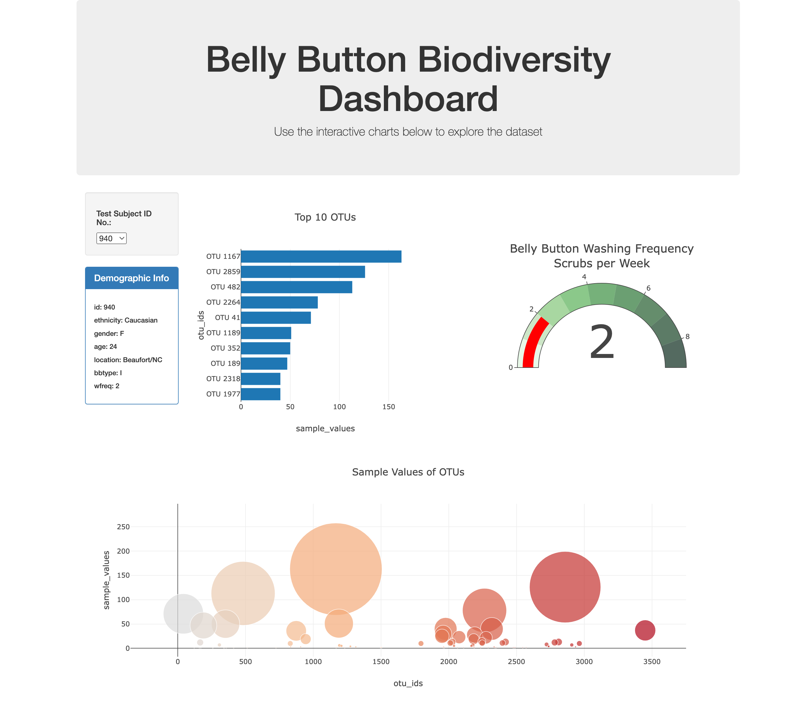

# belly-button-challenge
Belly Button Biodiversity Web Dashboard

## Contents
1. [Overview](#1-overview)
2. [Repository](#2-repository)
3. [Deployment](#3-deployment)
4. [Resources](#4-resources)

## 1. Overview
The Belly Button Biodiversity Dashboard is an interactive visualisation tool designed to explore the Belly Button Biodiversity dataset. This dataset catalogues the microbes that colonise human navels. The study reveals that a small number of microbial species, known as operational taxonomic units (OTUs), are present in over 70% of individuals. However, the majority of species are relatively rare. 

The dashboard allows users to analyse this microbial diversity through dynamic visualisations, including bar and bubble charts. It also displays demographic metadata associated with each sample. By enabling the selection and examination of individual samples, this dashboard highlights the significance of microbial presence and variation within the human navel microbiome.

## 2. Repository
This repository includes the following files:
- **`index.html`**: The main HTML structure for the dashboard.
- **`static/js/app.js`**: JavaScript file for data handling and visualisation.
- **`resources/samples.json`**: The dataset (referenced from a URL during runtime).
- **`README.md`**: Documentation file.

## 3. Deployment

Method A:

1. Clone this repository to view the code:
```
git clone https://github.com/bernardtse/belly-button-challenge.git
```
2. Open index.html in your web browser of choice.

Method B:

The dashboard has been deployed to GitHub Pages and can be accessed here:
- https://bernardtse.github.io/belly-button-challenge

1. Visit the deployed link above.
2. Use the dropdown menu to select an individual sample.
3. View the top 10 OTUs (bar chart), overall sample data (bubble chart), and demographic metadata.

## 4. Resources
### Tools and Libraries
- **D3.js**: Data loading and manipulation.
- **Plotly.js**: Interactive chart generation.
- **GitHub Pages**: Hosting and deployment.

### Features
- **Bar Chart**: Displays the top 10 OTUs for the selected individual.
- **Bubble Chart**: Visualises all OTUs with marker size and color indicating values.
- **Demographic Metadata**: Displays key-value metadata for the selected individual.
- **Interactivity**: Updates all visualisations dynamically based on user input.



### References
- [Plotly.js Documentation](https://plotly.com/javascript/)
- [D3.js Documentation](https://d3js.org/)

### Credits
This dashboard is part of the Module 14 Challenge for the Data Analytics program, leveraging the Belly Button Biodiversity dataset and incorporating interactive data visualisations.
